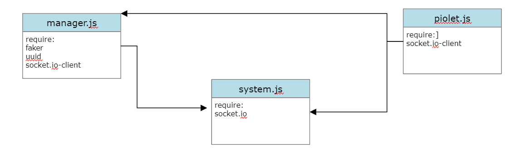

# airline-system2

[PR]()

[GitHub](https://github.com/alsatarysamah/airline-system2)

# UML

# System Overview
Airline System: we are going to build a control system for the **Qatar Airline**  where we will keep tracking each flight status by contacting the pilot of that flight who in turn will inform the manager and the system when a flight took-off and arrived.

*We have three main components in this system:*

- Manager (starting point)
- Pilot (taking actions)
- System (logging details)

we used ****soket.io**** to implement the connection between the client and server

**manager.js**

Trigger a 'new-flight' event every 10 seconds

Keep the manager alerted when a flight has arrived

**pilot.js**

Keep the pilot alerted when a new flight is scheduled

**system.js**

The main control room.

Prints the details of each event in a specific form:

Flight {

    event: 'took_off',

    time: 2022-02-28 15:30:00.,

    Details: {

    airLine: 'Royal Jordanian Airlines',

    destination: Manchester, UK'

    pilot: 'Jane doe',
    
    flightID: 'ds7g86sa8v87dsv60v876d',
}

